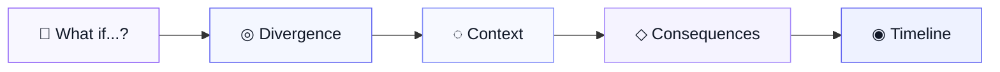
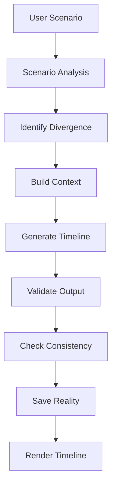
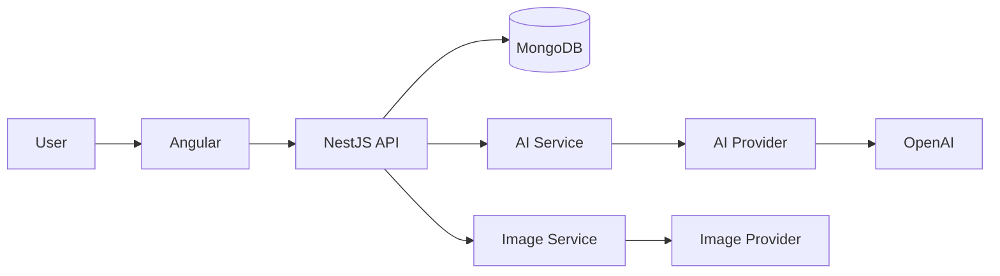

<div align="center">

# WHAT IF

### Explore the realities that could have been.

**What If** is an AI-powered platform for exploring alternative realities.

Change one event.
Create a divergence.
Discover what could happen next.

<br />


<br />

<div align="center">


</div>

</div>

---

## What is What If?

**What If** is a platform for exploring one simple question:

> **What would the world look like if one event had happened differently?**

You choose a moment.

What If identifies where reality changes, understands what existed before that moment, and uses AI to simulate the consequences that could follow.

Instead of returning a wall of generated text, the result becomes an **interactive alternative timeline**.

<br />

### For example

> **What if Neymar had not been injured during the 2014 World Cup?**

```text
                        REAL HISTORY
                             │
                             │
                    Brazil vs. Colombia
                             │
                             ▼
                    Neymar gets injured
                             │
                             │
                         July 2014
                             │
                    ● DIVERGENCE POINT
                             │
                             │
            What if the injury never happened?
                             │
              ┌──────────────┴──────────────┐
              │                             │
              ▼                             ▼
       Neymar remains fit          Brazil approaches the
       for the semifinal           semifinal differently
              │                             │
              └──────────────┬──────────────┘
                             ▼
                    New consequences
                             │
                 2014 → 2015 → 2016 → ...
```

The goal is **not to predict the future with certainty**.

The goal is to build a coherent simulation of a reality that **could have existed**.

---

## From a question to a reality

The core experience is intentionally simple.



### 1. Ask

The user starts with a single scenario.

```text
What if the Roman Empire had never fallen?
```

### 2. Find the divergence

What If determines **where the alternative reality separates from the original one**.

```text
────────────── real history ──────────────●──────────────
                                          │
                                          │ divergence
                                          ▼
                                   alternative reality
```

### 3. Understand the context

Before generating anything, the system considers the world around that event:

* what had already happened;
* who was involved;
* political, cultural or economic context;
* relationships between important actors;
* constraints that still exist in the alternative reality.

### 4. Simulate consequences

The AI generates events that follow from previous events.

Not:

```text
Random event
Random event
Random event
```

But:

```text
Event A
   │
   └── causes Event B
                 │
                 └── changes Event C
                               │
                               └── makes Event D possible
```

### 5. Explore

The frontend transforms that structured output into a visual timeline that the user can navigate.

---

# The Timeline

The timeline is the heart of What If.

It represents the evolution of an alternative reality through connected events.

```text
2014                  2015                  2016                  2017

 ●─────────────────────●─────────────────────●─────────────────────●
 │                     │                     │                     │
 ▼                     ▼                     ▼                     ▼

Divergence          Consequence          New scenario          Long-term
point               emerges              develops              impact
```

Each event contains enough information for the interface to explain **what happened, why it happened and how plausible it is**.

```json
{
  "date": "2014-07-08",
  "title": "Brazil reaches the World Cup final",
  "description": "With Neymar available, Brazil approaches the semifinal with a different attacking structure.",
  "consequence": "The national team's trajectory changes for the remainder of the tournament.",
  "plausibility": 0.72,
  "characters": [
    "Neymar",
    "Brazil National Team"
  ],
  "location": "Brazil"
}
```

This structured format is important.

The frontend does not need to interpret an unpredictable AI response. It receives data that can be validated and rendered consistently.

---

# Reality vs. Speculation

A key part of What If is knowing the difference between **what actually happened** and **what the AI is simulating**.

```text
KNOWN REALITY

✓ Brazil played Colombia on July 4, 2014
✓ Neymar suffered a back injury
✓ Neymar missed the semifinal


POINT OF DIVERGENCE

● Neymar does not suffer the injury


SIMULATION

◇ Neymar plays the semifinal
◇ Brazil changes its tactical approach
◇ Different results become possible
```

What If should never present generated events as historical facts.

Everything after the divergence is a **simulation based on assumptions and context**.

---

# Plausibility

Alternative history gets boring if every absurd possibility is treated as equally realistic.

That's why generated events can receive a **plausibility score**.

```text
HIGH PLAUSIBILITY

████████████████░░░░  82%

A consequence strongly supported by
the context and previous events.
```

```text
MEDIUM PLAUSIBILITY

███████████░░░░░░░░░  57%

Possible, but dependent on additional
assumptions.
```

```text
LOW PLAUSIBILITY

██████░░░░░░░░░░░░░░  31%

A more speculative path with greater
uncertainty.
```

The score is not a scientific probability.

It exists to communicate **how speculative each part of the timeline is**.

---

# Why not just ask ChatGPT?

You can already ask an LLM:

> What if Neymar had not been injured in 2014?

And receive a good answer.

That is not what What If is trying to compete with.

The difference is the **experience and system built around the model**.

| Generic AI chat                       | What If                                |
| ------------------------------------- | -------------------------------------- |
| Returns text                          | Builds a structured reality            |
| Conversation based                    | Timeline based                         |
| Context lives mostly in the prompt    | Context becomes application data       |
| Events may be disconnected            | Events have causal relationships       |
| No explicit divergence model          | Every reality starts from a divergence |
| Speculation is mixed into prose       | Plausibility can be represented        |
| Response disappears into chat history | Reality becomes an explorable object   |
| AI is the product                     | AI powers the product                  |

The model generates reasoning and content.

**What If defines how that content becomes a world.**

---

# The AI Pipeline

A timeline should not be created with a single instruction like:

> Write an alternative history about this.

The backend controls the generation process.



A simplified generation process looks like this:

```text
SCENARIO
──────────────────────────────────────

What if Neymar had not been injured
during the 2014 World Cup?


UNDERSTAND
──────────────────────────────────────

• What actually happened?
• When does reality change?
• Who is affected?
• What constraints still exist?


SIMULATE
──────────────────────────────────────

• Immediate consequences
• Secondary consequences
• Long-term consequences
• Cause-and-effect relationships


VALIDATE
──────────────────────────────────────

• Chronological order
• Required fields
• Contradictions
• Plausibility
• Structured output


RESULT
──────────────────────────────────────

Alternative Timeline
```

---

# Keeping the reality consistent

One of the biggest problems with long AI-generated timelines is contradiction.

Imagine this:

```text
2015 → Neymar moves to Manchester City

2017 → Neymar leaves Barcelona for PSG
```

The second event contradicts the reality that was already created.

Sending the entire previous timeline to the model forever would work for a while, but becomes increasingly expensive and inefficient.

Instead, What If can progressively maintain a **structured reality state**.

```text
REALITY STATE
│
├── Characters
│   │
│   └── Neymar
│       ├── club: Manchester City
│       ├── status: active
│       └── national_team: Brazil
│
├── Important Events
│   ├── Brazil won the 2014 World Cup
│   └── Neymar joined Manchester City
│
├── Relationships
│   └── ...
│
└── Constraints
    └── Neymar cannot simultaneously
        belong to another club
```

Future generations can receive only the context relevant to the next events.

This is one of the ideas that may eventually evolve into the **What If Engine**.

---

# Architecture

The first version intentionally avoids unnecessary complexity.



The application starts as a **modular monolith**.

No microservices.

No distributed infrastructure just because it looks good in an architecture diagram.

The goal is to build the product first.

---

# Provider abstraction

What If should use AI providers without becoming permanently coupled to one of them.

```text
AIService
    │
    ▼
AIProvider
    │
    ├── OpenAIProvider
    │
    ├── GeminiProvider
    │
    └── ...
```

The same principle applies to image generation.

```text
ImageGenerationService
        │
        ▼
   ImageProvider
        │
        ├── Provider A
        ├── Provider B
        └── ...
```

This allows models to be compared or replaced without rewriting the product's core logic.

---

# Tech Stack

<div align="center">

|    | Technology  | Responsibility                       |
| -- | ----------- | ------------------------------------ |
| 🎨 | **Angular** | Interface and timeline experience    |
| ⚙️ | **NestJS**  | API and application rules            |
| 🧠 | **OpenAI**  | Scenario reasoning and generation    |
| 🍃 | **MongoDB** | Timelines and reality data           |
| ⚡  | **Redis**   | Cache and rate limiting *(planned)*  |
| 📬 | **BullMQ**  | Background jobs *(planned)*          |
| ☁️ | **AWS**     | Production infrastructure *(future)* |

</div>

### Frontend

```text
Angular
│
├── Scenario input
├── Loading experience
├── Timeline visualization
├── Event details
├── Plausibility indicators
└── Reality navigation
```

### Backend

```text
NestJS
│
├── Scenario validation
├── Timeline generation
├── AI orchestration
├── Structured output validation
├── Persistence
├── Cost control
└── Provider abstraction
```

### Database

```text
MongoDB
│
└── Timeline
    ├── prompt
    ├── title
    ├── divergencePoint
    ├── summary
    ├── coverImage
    ├── events[]
    ├── metadata
    └── createdAt
```

---

# Project Structure

The repository starts simple.

```text
what-if/
│
├── frontend/
│   └── Angular application
│
├── backend/
│   └── NestJS application
│
├── docs/
│   ├── assets/
│   ├── architecture/
│   └── decisions/
│
├── README.md
└── LICENSE
```

As the product grows, features can be separated by domain without prematurely introducing microservices.

---

# MVP

The first version has one job:

<div align="center">

### One **What if...?**

↓

### One alternative timeline.

</div>

<br />

The MVP focuses on proving that exploring a generated reality is actually interesting.

### Included

* [ ] Scenario input
* [ ] Divergence detection
* [ ] Historical/context analysis
* [ ] Structured AI generation
* [ ] Chronological events
* [ ] Plausibility
* [ ] Timeline visualization
* [ ] Timeline persistence
* [ ] One generated cover image

### Not included yet

* Authentication
* Profiles
* Likes
* Comments
* Followers
* Public feed
* Complex branching
* Microservices
* Large cloud infrastructure

Those features only matter if the core experience works.

---

# Roadmap

## 01 — Generate a Reality

```text
What if...?
    │
    ▼
Divergence
    │
    ▼
Timeline
```

Build the first complete generation experience.

---

## 02 — Save Your Worlds

Add:

* authentication;
* timeline history;
* favorites;
* sharing;
* personal library.

Users stop generating disposable responses and start building a collection of realities.

---

## 03 — Branch the Timeline

This is where What If becomes much more interesting.

Any event can become another divergence.

```text
                           Reality B
                         /
                        /
Reality A ────────●────●──────── Reality C
                  │
                  │
           divergence
```

The user could open an event and ask:

> **What if this had happened differently?**

That creates a new timeline connected to the previous one.

---

## 04 — Discover

Public realities create a discovery layer.

```text
🔥 Popular

🆕 Recent

⭐ Most explored


History     Sports      Movies

Series      Games       Science

Culture     Fiction
```

What If starts becoming a platform rather than only a generation tool.

---

## 05 — Community

Users will eventually be able to interact around realities.

* profiles;
* likes;
* comments;
* followers;
* creators;
* notifications;
* rankings;
* shared timelines.

---

## 06 — What If Engine

The long-term vision goes beyond generating text.

A reality becomes a graph of entities and consequences.

```text
                        ┌───────────────┐
                        │    EVENT      │
                        └───────┬───────┘
                                │
                                ▼
                        ┌───────────────┐
                        │   DECISION    │
                        └───────┬───────┘
                                │
                                ▼
                      ┌───────────────────┐
                      │    CONSEQUENCE    │
                      └─────────┬─────────┘
                                │
                     ┌──────────┴──────────┐
                     │                     │
                     ▼                     ▼

              ┌─────────────┐       ┌─────────────┐
              │   EVENT A   │       │   EVENT B   │
              └──────┬──────┘       └──────┬──────┘
                     │                     │
                     ▼                     ▼

                 REALITY A             REALITY B
```

Instead of asking the AI to recreate everything every time, the application gradually understands:

* events;
* characters;
* decisions;
* relationships;
* world state;
* dependencies;
* causal chains.

Changing one event could then propagate through everything connected to it.

That is the direction of the **What If Engine**.

---

# Images

Images exist to strengthen the feeling that the user is exploring another world.

For the MVP:

```text
Alternative Reality
        │
        ▼
   Cover Image
```

Later:

```text
Timeline
│
├── Event 01 ── Visual
│
├── Event 02 ── Visual
│
├── Event 03 ── Visual
│
└── Event 04 ── Visual
```

Generation is abstracted behind an image provider so different models can be tested over time.

---

# Scaling

The infrastructure should grow because **the product needs it**, not because the architecture diagram looks cooler.

### Now

```text
Angular
   │
   ▼
NestJS
   │
   ├──────── MongoDB
   │
   └──────── AI Provider
```

### Later

```text
                         ┌──── AI Worker
                         │
Angular ── NestJS ── BullMQ
                         │
                         └──── Image Worker
                 │
                 ├──── Redis
                 │
                 ├──── MongoDB
                 │
                 └──── AWS
                       ├── S3
                       ├── CloudFront
                       ├── CloudWatch
                       └── ECS / Fargate
```

Redis may eventually support:

* repeated scenario caching;
* generation state;
* rate limiting;
* temporary context;
* BullMQ jobs.

---

# Example Worlds

What If should work across completely different types of scenarios.

<table>
<tr>
<td width="50%">

### ⚽ Sports

> What if Neymar had not been injured during the 2014 World Cup?

</td>
<td width="50%">

### 🏛️ History

> What if the Roman Empire had never fallen?

</td>
</tr>

<tr>
<td>

### 🎬 Fiction

> What if Mufasa had survived?

</td>
<td>

### 🦸 Characters

> What if Spider-Man had never been bitten?

</td>
</tr>

<tr>
<td>

### 🔬 Science

> What if artificial intelligence had emerged in 1950?

</td>
<td>

### 🌎 Humanity

> What if we discovered intelligent extraterrestrial life tomorrow?

</td>
</tr>
</table>

Different subjects.

Same fundamental idea:

```text
Reality
   │
   ▼
Change one thing
   │
   ▼
Follow the consequences
```

---

# Getting Started

## Requirements

You'll need:

```text
Node.js
npm
Angular CLI
MongoDB
```

---

## Clone the repository

```bash
git clone <repository-url>

cd what-if
```

---

## Backend

```bash
cd backend

npm install

npm run start:dev
```

Create your environment file:

```env
PORT=3000

MONGODB_URI=mongodb://localhost:27017/what-if

OPENAI_API_KEY=your_key_here
```

---

## Frontend

Open another terminal:

```bash
cd frontend

npm install

ng serve
```

The Angular application will be available at:

```text
http://localhost:4200
```

---

# Principles

The project follows a few simple principles.

### Product before infrastructure

Don't build distributed systems for users that don't exist yet.

### Structure before prompt size

Don't solve AI memory by endlessly increasing context.

### AI is a component

The application should remain valuable even when the underlying model changes.

### Cause before spectacle

Interesting consequences should come from previous events, not random surprises.

### Uncertainty should be visible

Generated speculation should never look like historical truth.

### The interface matters

What If should feel like exploring another reality.

Not chatting with a bot.

---

<div align="center">

<br />

### REALITY IS JUST ONE PATH.

# WHAT IF IT HAD TAKEN ANOTHER?

<br />

**Explore the realities that could have been.**

<br />

`Ask.`    `Diverge.`    `Explore.`

<br />

</div>

</div>

---

## License

License information will be added as the project evolves.
