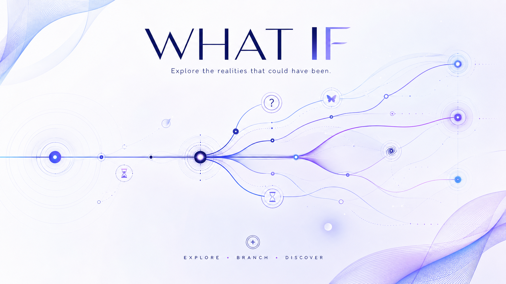
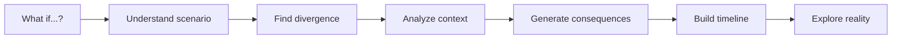
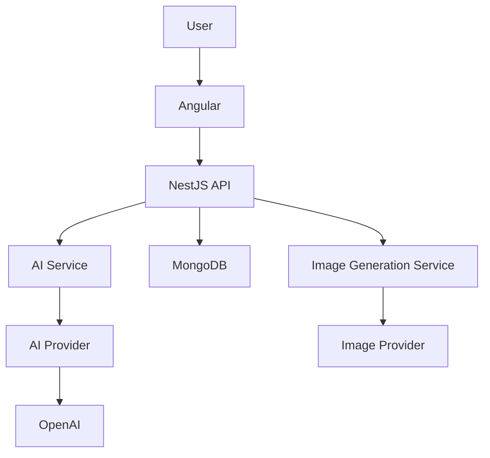
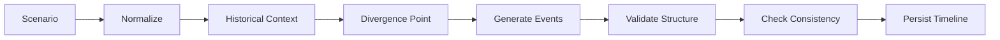

<div align="center">

<div align="center">



</div>

# WHAT IF

### Explore the realities that could have been.

**What If** is an AI-powered platform for exploring alternative realities.

Change one event.
Create a divergence.
Discover what could happen next.

<br />


</div>

---

## What is What If?

Most AI applications answer questions.

**What If explores consequences.**

The user changes a single event from the real or fictional world:

> **What if Neymar had never been injured during the 2014 World Cup?**

What If identifies the **point of divergence**, analyzes the original context and generates a structured alternative timeline showing how that change could propagate through time.

```text
REALITY

2014
  │
  │  Neymar gets injured
  │
  ▼
Brazil loses its main player


ALTERNATIVE REALITY

2014
  │
  ●  POINT OF DIVERGENCE
  │
  ├──────── Neymar remains healthy
  │
  ▼
Brazil reaches the next match
  │
  ▼
New consequences emerge
  │
  ▼
2015 ─── 2016 ─── 2017 ─── ...
```

The goal is not to predict what **would** have happened.

The goal is to explore what **could** have happened.

---

## The Experience

The core experience is intentionally simple.



The AI does not receive a prompt like:

> Write a story about this.

Instead, What If asks the model to reason about:

* the original context;
* the exact divergence point;
* people and entities involved;
* cause-and-effect relationships;
* short and long-term consequences;
* chronological consistency;
* plausibility;
* uncertainty;
* historical facts versus speculation.

The result is returned as structured data instead of free-form text.

---

# Timeline Engine

Every generated reality is represented as a sequence of connected events.

```text
                     ┌── Event A
                     │
Reality ──●──────────┼── Event B ───── Event D
          ▲          │
          │          └── Event C
          │
    Divergence Point
```

A timeline event may contain:

```json
{
  "date": "2014-07-08",
  "title": "Brazil reaches the World Cup final",
  "description": "With Neymar available, Brazil approaches the semifinal differently...",
  "impact": "The result changes the trajectory of the national team.",
  "plausibility": 0.74,
  "characters": ["Neymar", "Brazil National Team"],
  "location": "Brazil"
}
```

This allows the frontend to render realities consistently instead of trying to interpret arbitrary AI-generated text.

---

## Plausibility

What If is not supposed to treat every generated event as equally likely.

Each event can have an estimated level of plausibility.

```text
HIGH

████████████████░░░░  82%

The consequence follows naturally from the
divergence and known historical context.
```

```text
MEDIUM

███████████░░░░░░░░░  58%

Possible, but dependent on additional assumptions.
```

```text
LOW

██████░░░░░░░░░░░░░░  31%

Interesting scenario with higher uncertainty.
```

The objective is not mathematical prediction.

Plausibility exists to make the simulation more transparent and interesting.

---

# Features

### Alternative Timeline Generation

Transform a single **"What if...?"** into a chronological alternative reality.

---

### Divergence Detection

The system identifies the moment where the generated reality separates from the original one.

```text
Original reality ───────────●───────────────
                            │
                            └─────────────── Alternative reality
                              divergence
```

---

### Structured AI Output

AI responses are validated and transformed into predictable structures before reaching the frontend.

```text
User
  ↓
NestJS
  ↓
AI Provider
  ↓
Structured Output
  ↓
Validation
  ↓
Timeline
  ↓
Angular
```

---

### Cause and Effect

Events are not generated as isolated pieces of text.

Each consequence should exist because something before it happened.

```text
A changes
   ↓
B becomes possible
   ↓
C is affected
   ↓
D develops differently
```

---

### AI Generated Visuals

Generated realities can also receive visual representations.

For the MVP:

```text
Timeline
   ↓
Cover Image
```

Future versions may support:

```text
Timeline
   │
   ├── Event ── Image
   ├── Event ── Image
   ├── Event ── Image
   └── Event ── Image
```

---

### Reality Branches

Planned for a future version.

Any generated event may become another divergence point.

```text
                     Reality A
                    /
────────────●──────●
            │       \
            │        Reality B
            │
      First divergence
```

Eventually, timelines become a navigable tree of alternate realities.

---

# Architecture

What If starts intentionally simple.



The backend does not depend directly on a specific AI provider.

```text
AIService
   │
   ▼
AIProvider
   │
   ├── OpenAIProvider
   │
   ├── GeminiProvider
   │
   └── FutureProvider
```

The same principle is used for image generation.

```text
ImageGenerationService
   │
   ▼
ImageProvider
```

This keeps the application independent from any single AI company.

---

# Project Structure

```text
what-if/
│
├── frontend/
│   └── Angular
│
├── backend/
│   └── NestJS
│
├── docs/
│   ├── architecture/
│   └── decisions/
│
├── README.md
└── .gitignore
```

As the project grows, domain boundaries can evolve without prematurely splitting the application into microservices.

---

# Tech Stack

| Layer          | Technology         |
| -------------- | ------------------ |
| Frontend       | Angular            |
| Backend        | NestJS             |
| Language       | TypeScript         |
| Database       | MongoDB            |
| AI             | OpenAI             |
| Images         | AI Image Provider  |
| Cache          | Redis *(planned)*  |
| Queue          | BullMQ *(planned)* |
| Storage        | AWS S3 *(planned)* |
| Infrastructure | AWS *(future)*     |

---

# Why MongoDB?

A generated reality naturally behaves like a document.

```text
Timeline
│
├── prompt
├── title
├── divergencePoint
├── summary
│
├── events[]
│   ├── date
│   ├── title
│   ├── description
│   ├── impact
│   └── plausibility
│
├── coverImage
├── metadata
└── createdAt
```

That structure maps naturally to MongoDB while leaving room for future timeline branching.

---

# AI Pipeline

Generating a timeline involves more than sending one prompt to a model.



A simplified request might look like:

```text
SCENARIO

What if Neymar had never been injured
during the 2014 World Cup?


TASK

1. Identify the point of divergence.

2. Consider the known context before the divergence.

3. Generate plausible consequences.

4. Preserve chronological consistency.

5. Separate known facts from speculation.

6. Estimate plausibility.

7. Return structured JSON.
```

---

# Preventing Timeline Contradictions

Long timelines introduce an important problem:

> How does the AI remember what already happened?

Instead of continuously sending the entire generated story back to the model, What If can maintain structured **world state**.

```text
Timeline Context

Characters
├── Neymar
│   ├── club: Barcelona
│   ├── status: active
│   └── injuries: none
│
Events
├── Brazil won semifinal
├── Brazil reached final
└── Neymar remained healthy
│
World State
├── Brazil confidence increased
└── tournament trajectory changed
```

Future generations can receive the relevant state instead of the complete timeline.

This is one of the first steps toward the **What If Engine**.

---

# Development Roadmap

### Phase 01 — Timeline MVP

**One question → one alternative reality.**

* [ ] What If input
* [ ] Scenario interpretation
* [ ] Divergence point detection
* [ ] Structured timeline generation
* [ ] Plausibility
* [ ] Timeline visualization
* [ ] Timeline persistence
* [ ] Cover image generation

No social network.

No complex branching.

No unnecessary infrastructure.

The priority is validating whether exploring an alternative reality is actually fun.

---

### Phase 02 — Personal Library

* [ ] Authentication
* [ ] Timeline history
* [ ] Saved realities
* [ ] Favorites
* [ ] Sharing

---

### Phase 03 — Branching Realities

Users will be able to select an existing event and ask:

> What if this happened differently?

```text
                       ┌──── Reality B
                       │
Reality A ─────●───────┤
               │       │
               │       └──── Reality C
               │
          New divergence
```

---

### Phase 04 — Discovery

Public realities and community content.

```text
Popular
Recent
Most explored

History
Sports
Movies
Series
Games
Science
Culture
Fiction
```

---

### Phase 05 — Social Layer

* [ ] Profiles
* [ ] Followers
* [ ] Likes
* [ ] Comments
* [ ] Rankings
* [ ] Notifications
* [ ] Creators

---

### Phase 06 — What If Engine

The long-term vision.

Instead of treating timelines as generated text, the system starts representing them as a temporal graph.

```text
EVENT
  │
  ▼
CHARACTER
  │
  ▼
DECISION
  │
  ▼
CONSEQUENCE
  │
  ├─────────────┐
  ▼             ▼
EVENT          EVENT
  │             │
  ▼             ▼
REALITY A     REALITY B
```

Changing one node may propagate consequences through the graph.

At that point, What If becomes more than an AI application.

It becomes a **narrative simulation engine**.

---

# Getting Started

## Requirements

Make sure you have installed:

* Node.js
* npm
* Angular CLI
* MongoDB

---

## Clone

```bash
git clone <YOUR_REPOSITORY_URL>
cd what-if
```

---

## Backend

```bash
cd backend
npm install
npm run start:dev
```

Create a `.env` file:

```env
PORT=3000

MONGODB_URI=mongodb://localhost:27017/what-if

OPENAI_API_KEY=your_openai_api_key
```

---

## Frontend

```bash
cd frontend
npm install
ng serve
```

Then open:

```text
http://localhost:4200
```

---

# Future Infrastructure

Infrastructure should grow with usage.

Not with the architecture diagram.

### MVP

```text
Angular
   │
NestJS
   │
├── MongoDB
└── AI Provider
```

### Scale

```text
                         ┌── AI Worker
                         │
Angular → NestJS → Redis + BullMQ
                         │
                         └── Image Worker

MongoDB

AWS
├── S3
├── CloudFront
├── CloudWatch
├── Lambda
└── ECS / Fargate
```

Redis can eventually be used for:

* identical scenario caching;
* AI request rate limiting;
* temporary generation states;
* distributed jobs;
* BullMQ.

---

# Example Scenarios

```text
What if Neymar had never been injured in 2014?
```

```text
What if Mufasa had survived?
```

```text
What if the Roman Empire had never fallen?
```

```text
What if Spider-Man had never been bitten?
```

```text
What if artificial intelligence had been created in 1950?
```

```text
What if humanity discovered intelligent life tomorrow?
```

Every question creates a new point of divergence.

Every divergence creates another possible world.

---

# Design Philosophy

What If should never feel like:

```text
Chat
 ↓
AI writes text
 ↓
Done
```

It should feel like:

```text
            REALITY
               │
               ●
              / \
             /   \
            /     \
           ▼       ▼
      POSSIBILITY POSSIBILITY
           │       │
           ▼       ▼
        CONSEQUENCES
```

The interface exists to make users feel like they are **navigating a reality**, not reading an AI response.

---

<div align="center">

## One event.

## Infinite consequences.

<br />

### WHAT IF?

*Explore the realities that could have been.*

</div>

---

## License

License information will be added as the project evolves.
